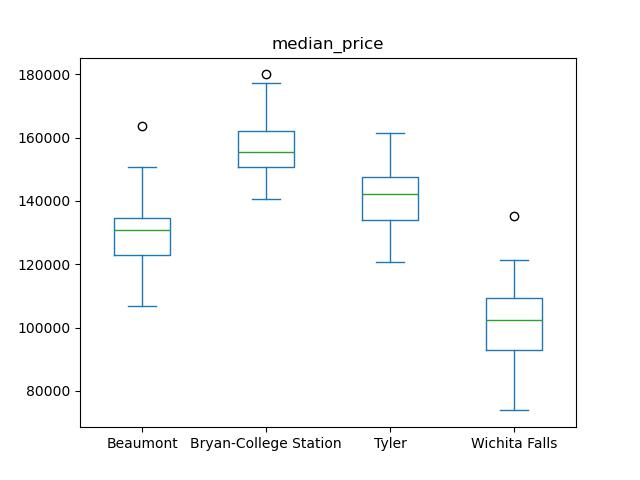
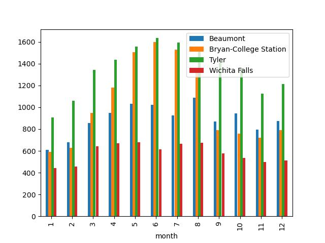
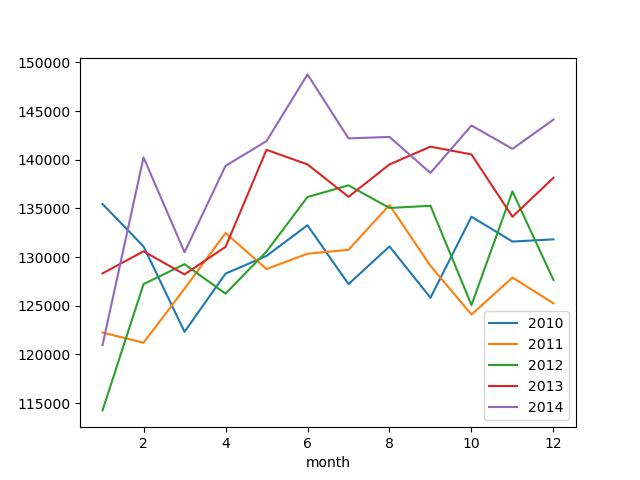

# **Mercato Immobilizre del Texas** #

## Analisi delle variabili ##
* **city**: stringa che rappresenta il nome della città
* **year**: numero intero che rappresenta l'anno di riferimento
* **month**: numero intero che rappresenta il mese di riferimento (Gennaio = 1 ... Dicembre = 12)
* **sales**: numero intero che rappresenta il numero totale di vendite
* **volume**: numero decimale che rappresenta il valore totale delle vendite in milioni di dollari
* **median_price**: numero intero che rappresenta il prezzo medio di vendita in dollari
* **listings**: numero intero che rappresenta il numero  totale di annunci attivi
* **months_inventory**: numero decimale che rappresenta la quantità di tempo necessaria per vendere tutte le inserzioni correnti al ritmo attuale delle vendite, espresso in mesi

## Indici di posizione, variabilità e forma ##
| variabile        | min   | 1st quartile | mediana | mean   | 3rd quartile | max    |
|------------------|-------|--------------|---------|--------|--------------|--------|
| sales            | 79.0  | 127.0        | 175.5   | 192.3  | 247.0        | 423.0  |
| volume           | 8.166 | 17.660       | 27.062  | 31.005 | 40.893       | 83.547 |
| median_price     | 73800 | 117300       | 134500  | 132665 | 150050       | 180000 |
| listings         | 743   | 1026         | 1618    | 1738   | 2056         | 3296   |
| months_inventory | 3.400 | 7.800        | 8.950   | 9.193  | 10.950       | 14.900 |

Per le altre variabili *city*, *year* e *month* verrà calcolata solo la distribuzione di frequenza

| city                  | frequenza assoluta | frequenza relativa |
|-----------------------|--------------------|--------------------|
| Beaumont              | 60                 | 0.25               |
| Bryan-College Station | 60                 | 0.25               |
| Tyler                 | 60                 | 0.25               |
| Wichita Falls         | 60                 | 0.25               |

| year | frequenza assoluta | frequenza relativa |
|------|--------------------|--------------------|
| 2010 | 48                 | 0.2                |
| 2011 | 48                 | 0.2                |
| 2012 | 48                 | 0.2                |
| 2013 | 48                 | 0.2                |
| 2014 | 48                 | 0.2                |

| month | frequenza assoluta | frequenza relativa |
|-------|--------------------|--------------------|
| 1     | 20                 | 0.08333333         |
| 2     | 20                 | 0.08333333         |
| 3     | 20                 | 0.08333333         |
| 4     | 20                 | 0.08333333         |
| 5     | 20                 | 0.08333333         |
| 6     | 20                 | 0.08333333         |
| 7     | 20                 | 0.08333333         |
| 8     | 20                 | 0.08333333         |
| 9     | 20                 | 0.08333333         |
| 10    | 20                 | 0.08333333         |
| 11    | 20                 | 0.08333333         |
| 12    | 20                 | 0.08333333         |

Le osservazioni all'interno di questo dataset sono omogenee per tutti i mesi di ogni anno e per ogni località.
Quindi è possibile estrarre le osservazioni per mese e anni, in modo da avere una rappresentazione più precisa della distribuzione delle vendite e
osservare le variazioni per ogni città.

## Identificazione delle variabili con maggiore variabilità e asimmetria ##
La variabile con più alta variabilità è **volume**.
Sono riuscito a trovare questo risultato calcolando il coefficiente di variazione, allego di seguito tabella con i risultati.
| variabile        | cv    |
|------------------|-------|
| sales            | 41.42 |
| volume           | 53.71 |
| median_price     | 17.08 |
| listings         | 43.31 |
| months_inventory | 25.06 |

La variabile con più alta asimmetria è **volume**
Sono riuscito a trovare questo risultato calcolando l'indice di Gini, allego di seguito tabella con i risultati.
| variabile        | indice di Gini |
|------------------|----------------|
| sales            | 0.23           |
| volume           | 0.30           |
| median_price     | 0.10           |
| listings         | 0.24           |
| months_inventory | 0.14           |

## Creazione di classi per una variabile quantitativa ##
| range            | median price |
|------------------|--------------|
| (70000, 100000]  | 26           |
| (100000, 130000] | 69           |
| (130000, 160000] | 124          |
| (160000, 190000] | 21           |

Dal grafico possiamo vedere che 124 immobili su 240 osservazioni sono stati venduti in un range che va da 130000 a 160000, quindi più del 50% del totale degli immobili osservati.

## Calcolo della probabilità ##
La probabilità che esca la città Beaumont è pari al 25%, che riporti il mese di lugio 8.33% e il mese di dicembre 2012 1.66%

## 6. Creazione di nuove variabili ##
| city         | year | month | sales | volume | median_price| listings | months_inventory | median_price_index     | sales_announcements_index |
|--------------|------|-------|-------|--------|-------------|----------|------------------|------------------------|---------------------------|
|Beaumont      | 2010 | 1     | 83    |	14.16  | 163800.0    | 1533     | 9.5              | prezzo poco frequente  | 0.12                      | 
|Beaumont      | 2010 | 2	  | 108   |	17.69  | 138200.0    | 1586     | 10.0             | prezzo molto frequente | 0.84                      |
|Beaumont      | 2010 | 3	  | 182   |	28.70  | 122400.0    | 1689     | 10.6             | prezzo frequente       | 2.99                      |
|Beaumont      | 2010 | 4	  | 200   |	26.82  | 123200.0    | 1708     | 10.6             | prezzo frequente       | 3.52                      |
|Beaumont      | 2010 | 5	  | 202   |	28.83  | 123100.0    | 1771     | 10.9             | prezzo frequente       | 3.58                      |
| ...          | ...  | ...   | ...   | ...    | ...         | ...      | ...              | ...                    | ...                       |
|Wichita Falls | 2014 | 8	  | 137   |	16.13  | 99600.0     | 973      | 8.3              | prezzo poco frequente  | 1.69                      |
|Wichita Falls | 2014 | 9	  | 110   |	12.02  | 90000.0     | 940      | 8.1              | prezzo poco frequente  | 0.90                      |
|Wichita Falls | 2014 | 10	  | 112   |	13.82  | 113300.0    | 905      | 7.8              | prezzo frequente       | 0.96                      |
|Wichita Falls | 2014 | 11	  | 96    |	11.31  | 108000.0    | 870      | 7.5              | prezzo frequente       | 0.49                      |
|Wichita Falls | 2014 | 12	  | 109   |	13.88  | 103800.0    | 821      | 7.0              | prezzo frequente       | 0.87                      |

Sono state create 2 nuove colonne nel dataset median_price_index e sales_announcements_index. median_price_index è un indice che indica la frequenza del prezzo di vendità, sono stati inseriti 3 indici: 'prezzo poco frequente' , 'prezzo frequente' e 'prezzo molto frequente'. sales_announcements_index è un indice che indica un punteggio di vendita degli immobili nel mese, l'indice va da 0 a 10.

## Creazione di visualizzazioni con ggplot2 ##
\
Boxplot confronto prezzo medio tra città.

\
Grafico a barre confronto totale vendite per mese e città.

\
Line charts confronto andamento delle vendite per anno

## Conclusioni ##
Analizzando tutte le osservazioni che come abbiamo visto in precedenza sono ben disstribuite per città, mese e anno sono emerse le seguenti conclusioni:
* Nella città di Bryan-Collage Station sono state registrate le vendite con maggior prezzo, invece la città di tyler ha rigistrato il maggior numero di vendite
* L'anno 2014 è stato l'anno con il prezzo medio di vendita più alto degli anni osservati
* Ogni anno dal 2010 al 2014 il prezzo medio di vendita è salito

Quindi come strategio per aumentare ancora di più il numero di vendite è andare a proporre una campagna marketing nelle cità come Wichita Falls. Questa città ha registrato il minor numero di vendite al mese, così da fortificare e aumentare le vendite. Come prezzo per un immobile cosiglio un range che va dai 130000 a 160000, come possiamo vedere nel grafico a barre relativo al prezzo medio di vendita.